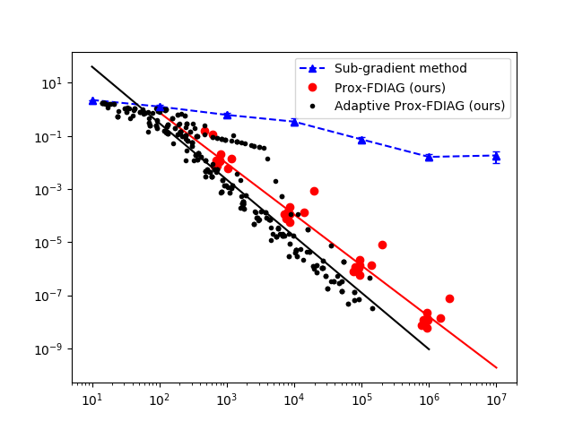

# Dual Implicit Accelerated Gradient (DIAG) method for nonconvex-concave smooth minimax optimization

This repo containts the code to reproduce the experiments of our paper: 
[*Kiran Koshy Thekumparampil, Prateek Jain, Praneeth Netrapalli, and Sewoong Oh. Efficient Algorithms for Smooth Minimax Optimization, NeurIPS 2020*](https://arxiv.org/abs/1907.01543).

## System prerequisites

- python 3.6
- numpy 1.14.1
- matplotlib 2.1.2

## Running the experiments

We implement the following three algorithms to solve quadratic nonconvex finite minimax problems

1. *Prox-FDIAG*: Algorithm 5 of [\[TJNO\]](https://arxiv.org/abs/1907.01543) in `minimax/algos/proxfdiag.py`
2. *Adaptive Prox-FDIAG*: Algorithm 6 of [\[TJNO\]](https://arxiv.org/abs/1907.01543) in `minimax/algos/proxfdiag.py`
3. *Sub-gradient method (constant/variable stepsize)*: Algorithm 1 of [\[DD\]](https://arxiv.org/abs/1802.02988) in `minimax/algos/subgrad.py`

To optimize the problems using different algorithms use the following commands

1. *Prox-FDIAG method*: `python expt_quadratic.py ProxFDIAG`
2. *Adaptive Prox-FDIAG method*: `python expt_quadratic.py AdaptiveProxFDIAG`
3. *Sub-gradient method (constant stepsize)*: `python expt_quadratic.py SubGrad`
4. *Sub-gradient method (variable stepsize)*: `python expt_quadratic.py SubGradVar`

Note that the above commands uses these algorithms to optimize nonconvex problems generated using 10 different preset random seeds. Optionally, we can also pass a specific random seed as an argument. For example, to optimize the problem generated using the seed value 2 use the command

`python expt_quadratic.py AdaptiveProxFDIAG 2`

### Generating the figure

To generate the figure first run the following commands to optimize the problems using *Prox-FDIAG*, *Adaptive Prox-FDIAG*, and *Sub-gradient (variable stepsize)* methods.

`python expt_quadratic.py ProxFDIAG`

`python expt_quadratic.py AdaptiveProxFDIAG`

`python expt_quadratic.py SubGradVar`

Note that we ignore the constant stepsize version of *Sub-gradient method (constant stepsize)* as it is very slow. After running the above commands, we can generate the following figure using the command

`python plot_moreau_grad_vs_nof_grads.py`

Note, that this figure is different from the one in [NeurIPS 2020](https://proceedings.neurips.cc/paper/2019/hash/05d0abb9a864ae4981e933685b8b915c-Abstract.html) paper, because:
1. We compute the gradient of the Moreau envelope using higher accuracy, and
2. *Sub-gradient method* outputs a randomly sampled iterate as given in Algorithm 1 of [\[DD\]](https://arxiv.org/abs/1802.02988). In the [NeurIPS 2020](https://proceedings.neurips.cc/paper/2019/hash/05d0abb9a864ae4981e933685b8b915c-Abstract.html) paper, initial implementation of *Sub-gradient method* at iteration `k` outputs the iterate with the approximately the smallest gradient of the Moreau envelope seen till then (see details in [NeurIPS 2020](https://proceedings.neurips.cc/paper/2019/hash/05d0abb9a864ae4981e933685b8b915c-Abstract.html)). We updated the implementation as the initial version is prohibitively slow.

To use the the initial NeurIPS 2020 version of *Sub-gradient method* use the command

`python expt_quadratic.py SubGradVar_neurips`

## References

\[TJNO\] Kiran Koshy Thekumparampil, Prateek Jain, Praneeth Netrapalli, and Sewoong Oh, "Efficient Algorithms for Smooth Minimax Optimization", NeurIPS 2020, [NeurIPS 2020](https://proceedings.neurips.cc/paper/2019/hash/05d0abb9a864ae4981e933685b8b915c-Abstract.html), [https://arxiv.org/abs/1907.01543](https://arxiv.org/abs/1907.01543)

\[DD\] Damek Davis, and Dmitriy Drusvyatskiy, "Stochastic subgradient method converges at the rate O(k^{−1/4}) on weakly convex functions", [https://arxiv.org/abs/1802.02988](https://arxiv.org/abs/1802.02988)